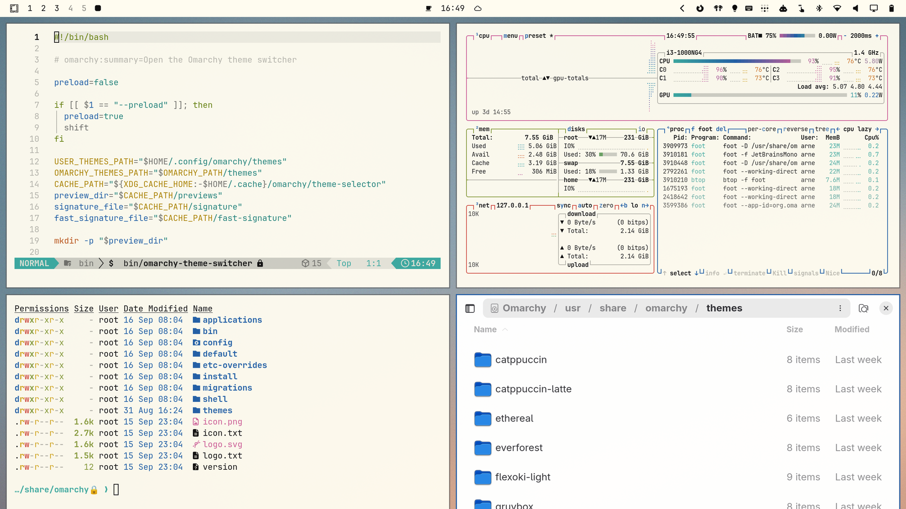

# Superlight

**Morning light on warm paper.** Superlight is an [Omarchy](https://omarchy.org) theme that pairs the calm, ink-on-paper palette of [Flexoki Light](https://stephango.com/flexoki) with a soft gradient wallpaper: a misty blue sky opening onto a peach-colored horizon. Bright, friendly and easy on the eyes, all day long.



## Why Superlight

- **Paper, not glare.** A warm off-white base (`#FFFCF0`) with near-black ink text keeps things crisp without the harshness of pure white.
- **A proven palette.** Flexoki was designed for reading and writing: its inky blue, red, green and gold stay distinct and legible in the terminal, the editor and the bar.
- **A wallpaper that breathes.** The soft blue-to-peach gradient gives the desktop depth while staying quiet behind your windows.
- **Clean gradients, made from scratch.** The wallpapers are generated procedurally in 3840×2400 by [`wallpaper/generate.sh`](wallpaper/generate.sh), with fine film grain as dithering, so the gradient shows no banding.
- **Two wallpapers included.** The light daytime sky is the default; the deeper dusk version from Superdark is one `omarchy theme bg next` away.
- **Everything themed.** Omarchy generates matching configs from `colors.toml` for Hyprland, the shell/bar, terminals, btop, Neovim, VS Code, Chromium and more, plus a matching boot-unlock screen.

## Install

```bash
omarchy theme install https://github.com/workingtitle/omarchy-superlight-theme
```

To use its unlock screen at boot, pick **Superlight** under *Style → Unlock* in the Omarchy menu.

## Sister theme

When the sun goes down, switch to **[Superdark](https://github.com/workingtitle/omarchy-superdark-theme)**: the same sky at dusk in deep navy, peach and rust, with a palette tuned to match.

## Credits & license

- Color palette: [Flexoki](https://stephango.com/flexoki) by Steph Ango (MIT).
- Wallpapers: generated from scratch by [`wallpaper/generate.sh`](wallpaper/generate.sh).
- Unlock logo: [Omarchy](https://github.com/basecamp/omarchy) (MIT).

MIT, including the wallpapers. See [LICENSE](LICENSE).
